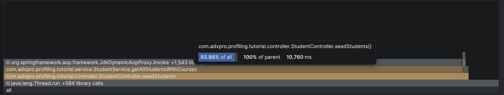
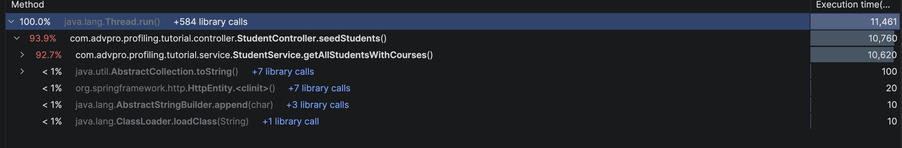
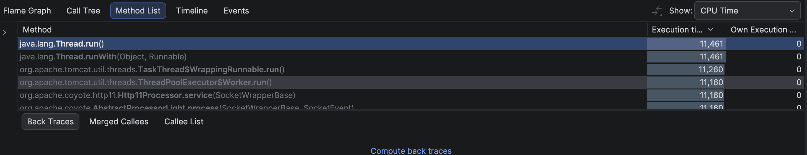
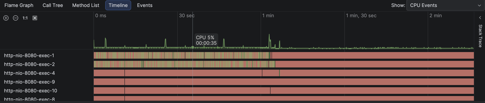
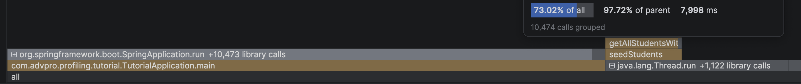
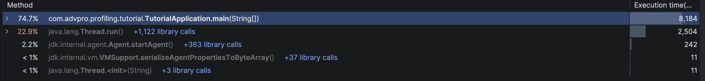
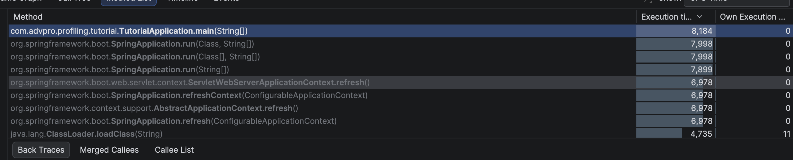
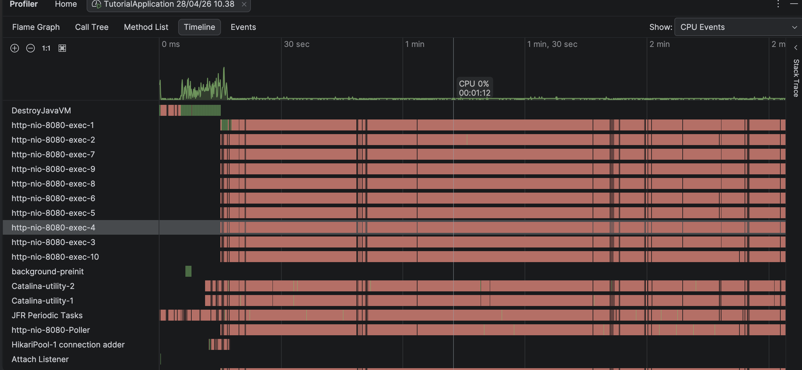

PERFORMANCE TESTING

Profiling
(SEBELUM)

(SESUDAH)

REFLECTION
1. Perbedaan JMeter vs IntelliJ Profiler
   JMeter itu dipakai buat performance testing dari luar aplikasi, misalnya ngetest berapa banyak request yang bisa ditangani server, response time, dll. Fokusnya ke behavior aplikasi secara keseluruhan.
   Sedangkan IntelliJ Profiler dipakai dari dalam aplikasi (codelevel), buat liat bagian mana yang makan CPU besar, memory, atau lambat. Jadi lebih ke ngulik isi dalam kode.

2. Peran profiling dalam cari weak point
   Profiling bantu banget karena kita bisa lihat method mana yang paling sering dipanggil, paling lama jalan, atau paling boros resource. Dari situ keliatan bagian mana yang jadi bottleneck, jadi nggak nebak-nebak lagi.

3. Efektivitas IntelliJ Profiler
   Menurutku efektif, apalagi buat ngerti masalah di level kode. Visualisasi seperti call tree atau flame graph bikin kita cepat lihat bagian yang bermasalah tanpa harus cek satu-satu.

4. Tantangan & cara ngatasinnya
   Tantangannya biasanya:
   * data hasil test banyak dan kadang bingung bacanya
   * hasil bisa beda-beda tiap run
   * susah reproduksi kondisi real user
   Cara ngatasinnya:
   * fokus ke metrik penting aja (CPU, memory, response time)
   * jalankan test beberapa kali biar lebih konsisten
   * coba simulasi kondisi yang mendekati real (load, data, dll)

5. Manfaat IntelliJ Profiler
   * bisa tau bagian kode yang lambat secara detail
   * bantu optimasi lebih tepat sasaran
   * hemat waktu debugging karena langsung kelihatan problemnya
   * ada visualisasi yang gampang dipahami

6. Kalau hasil JMeter & Profiler beda
   Ini wajar, karena JMeter lihat dari luar, Profiler dari dalam, jadi paling bisa:
   * bandingin dua-duanya buat cari pola
   * cek lagi skenario testing (apakah sama atau nggak)
   * gunakan keduanya sebagai pelengkap, bukan saling menggantikan

7. Strategi optimasi & menjaga fungsi tetap aman
   Strateginya:
   * optimasi bagian yang paling berat dulu (hotspot)
   * perbaiki algoritma atau query yang nggak efisien
   * kurangi object creation atau looping yang nggak perlu
   biar nggak merusak fungsi:
   * selalu pakai testing (unit test / integration test)
   * bandingin hasil sebelum & sesudah optimasi
   * lakuin perubahan sedikit-sedikit, jangan langsung besar

